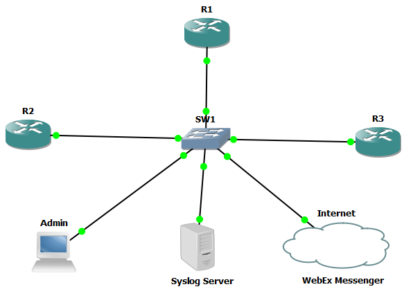
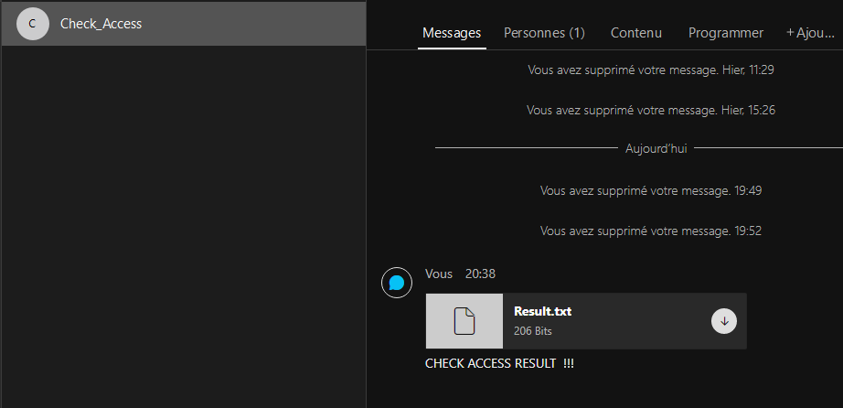

[](https://developer.cisco.com/codeexchange/github/repo/cherifimehdi/Check_Access)

# Check_Access Project
  
This project leverages [Genie/pyATS](https://pubhub.devnetcloud.com/media/genie-docs/docs/cookbooks/index.html) framework, [WebEx Messenger](https://www.webex.com/) and [python logging module](https://docs.python.org/3/library/logging.html) to check access into network devices by displaying, sending the result to WebEx Messenger Space and triggering logs to Syslog server for information and maintenance purposes. This project exploits the simplicity of __Genie/pyATS__ framework with its ***connect()*** method in order to check the access by simply handling ***ConnectionError*** exception.
Keep in mind that this project is not to test connectivity, it allows to check access and can be used in many ways : 

   - Check access routinely
   - Deployed separately or integrated in projects such as : before each provisioning or retrieving data form devices or CI/CD pipeline process to priore check accessibility

# Topology and Simulation

Here is the topology used in this project:



[GNS3](https://gns3.com/) was used with Cisco routers and a Linux machine as Admin since the framework __Genie/PyATS__ works only on Linux or Mac OSX. However, you can use the Windows Subsystem for Linux (WSL), as the case of this project represented here by the __Admin__ host as shown in the topology. You can also test this project using your own emulator or the [DevNet Sandbox Cisco Modeling Labs (CML)](https://devnetsandbox.cisco.com/RM/Topology). You just need to modify the parameters concerning the information about the devices used in the __connex.yml__ file (IP addresses, users, IOS type, ...).

# Packages installation and Requierements

The best practice is to leverage Python Virtual Environments (env). Please follow these steps to clone the Git repository and create and active the virtual environment:

```
git clone https://github.com/cherifimehdi/Check_Access.git
cd Check_Access
python3 -m venv venv
source venv/bin/activate
pip3 install -r requirements.txt
```
As the packages used are found in requirements.txt file, alternatively, you can install the packages as follows:

```
pip3 install pyats[full]
pip3 install requests
pip3 install requests-toolbelt
pip3 install prettytable
pip3 install python-dotenv
```
# Before using the Check_Access Project

Please consider to:

1. Modify the parameters in __connex.yml__ file according to your devices configuration and types (IOS, ip, credentials,...)
2. Create a WebEx Messenger Space to send to it the result as a text file
3. Update the _Token_ variable in the __.env__ file, the _roomId_ and the address of your Syslog Server in __check_access.py__ script
4. Choose and install your Syslog server. For this project I used the open source [Tftpd32 software](https://pjo2.github.io/tftpd64/) by _Ph. Jounin_


# Check_Access project in action

Once the dependenties are installed and parameters are taken into account for __connex.yml__, __.env__ files and __check_access.py__ script, you can run the script __check_access.py__.

This project allows : 

1. Check access for each device in the testbed file __connex.yml__
2. Trigger log message for each device and send the result to the Syslog server
3. Generate the final result as table to print and send as text file to the WebEx Messenger space

## In case of no access problem

Here we run __check_access.py__ script from the __Admin__ host:

```console
(Check_Access) [mehdi@Check_Access]$ python check_access.py
+--------------------+
|    Access Check    |
+--------+-----------+
| Device |   Status  |
+--------+-----------+
|   R1   | Access Ok |
|   R2   | Access Ok |
|   R3   | Access Ok |
+--------+-----------+
```

Here the result sent to the Syslog Server: 


Here the result sent as a text file to our Webex Space:



Now, we can download the __Result.txt__ file and consult the check access result for the network devices as shown below:


## In case of access problem

Now we will deactivate the management interface of the router R2


Now we run the __check_access.py__ script from the __Admin__ host:

```console
(Check_Access) [mehdi@Check_Access]$ python check_access.py
+--------------------+
|    Access Check    |
+--------+-----------+
| Device |   Status  |
+--------+-----------+
|   R1   | Access Ok |
|   R2   | No Access |
|   R3   | Access Ok |
+--------+-----------+
```
As expected, the Syslog server received the logs:


The __Result.txt__ file is now available for download and viewing from WebEx Messenger Space


As it shows from the console, the Syslog server and the __Result.txt__ file, we have an access issue with the Router R2.

# About me

PhD in Electronics and an active Cisco CCAI Instructor and Network Engineering Trainer. Part of Cisco DevNet Class 2020. Cisco DevNet Code Exchange and Automation Exchange Contributor.
I am interesting in all about NetDevOps, Networking programmability and automation. I am a Cisco contents fan.
## Contact Me

[LinkedIn](www.linkedin.com/in/cherifi-mehdi)

[GitHub](https://github.com/cherifimehdi)

[Credly](https://www.credly.com/users/mehdi-cherifi/badges)

[Twitter](https://twitter.com/LocketKeepsake)
